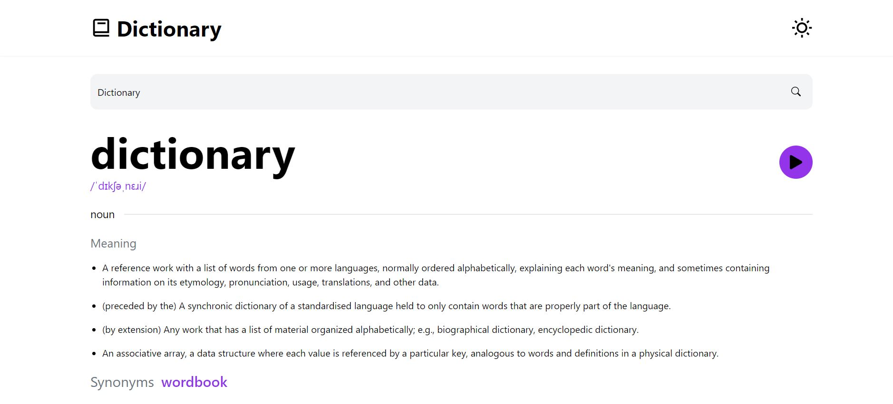

# Realtor

Dictioanry App is web application that provides users with access to a dictionary, which is a reference book containing an alphabetical list of words, their definitions, and sometimes other information such as pronunciation, origin, and usage examples. Dictionary apps can be used to look up the meanings of words, find synonyms and antonyms, learn new vocabulary, and improve language skills..

## Table of contents

- [Screenshot](#screenshot)
- [Links](#links)
- [Built with](#built-with)
- [Author](#author)

### Screenshot



### Links

- Solution URL: [https://github.com/ErysCode7/dictionary-app](https://github.com/webstar0411/dictionary-app)
- Live Site URL: [https://dictionary-app-sandy.vercel.app/](https://dictionary-app-sandy.vercel.app/)

1. Clone the repo

   ```sh
   git clone git@github.com:ErysCode7/dictionary-app.git
   ```

2. Install NPM packages

   ```sh
   npm install
   ```

3. Run app

   ```sh
   npm start
   ```

### Built with

- [Next.js](https://nextjs.org/) - JS library
- [TypeScript](https://www.typescriptlang.org/) - JavaScript with syntax for types
- [TailwindCSS](https://tailwindcss.com/) - CSS Framework
- [Dictionary API](https://dictionaryapi.dev/) - Dictionary API
